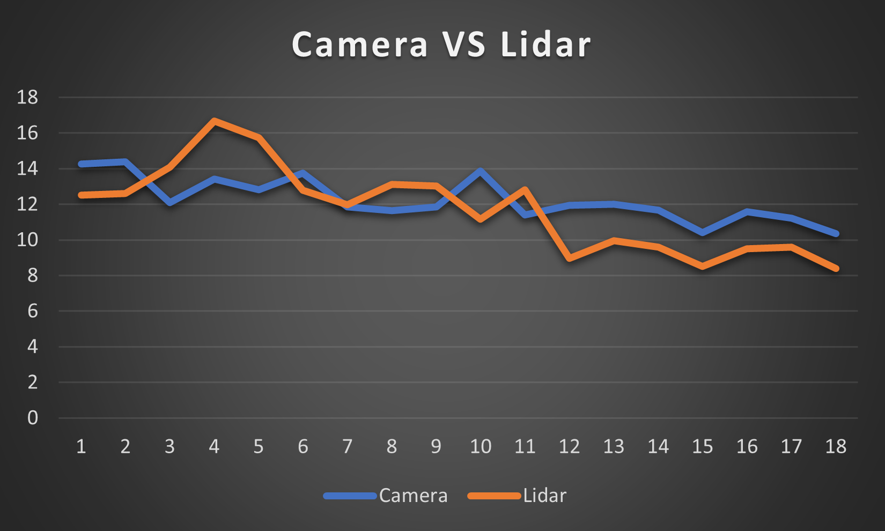
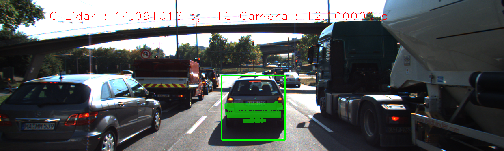
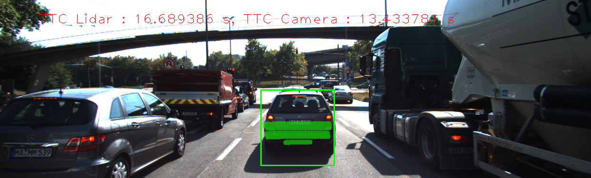
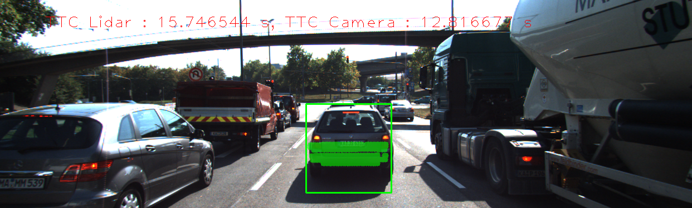
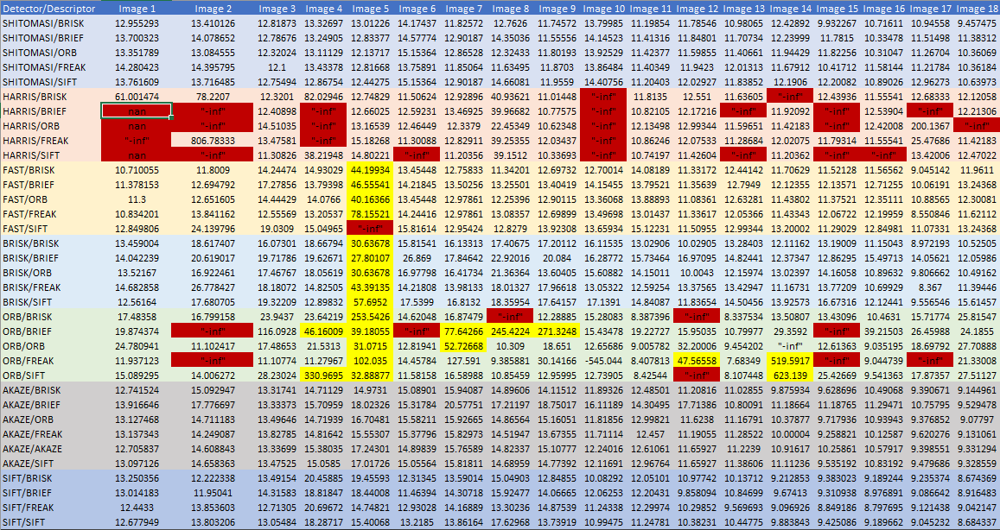
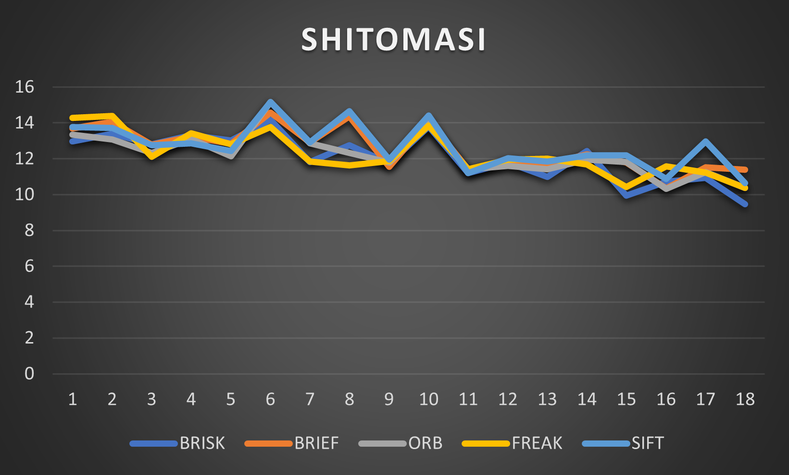
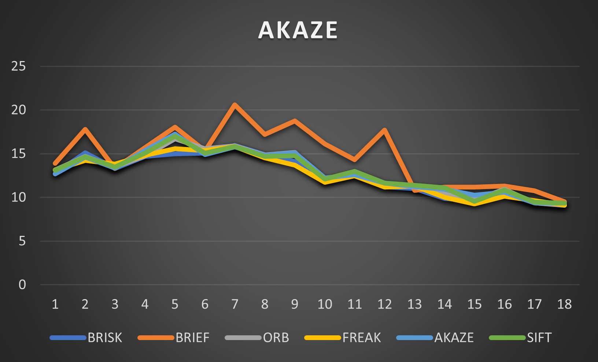
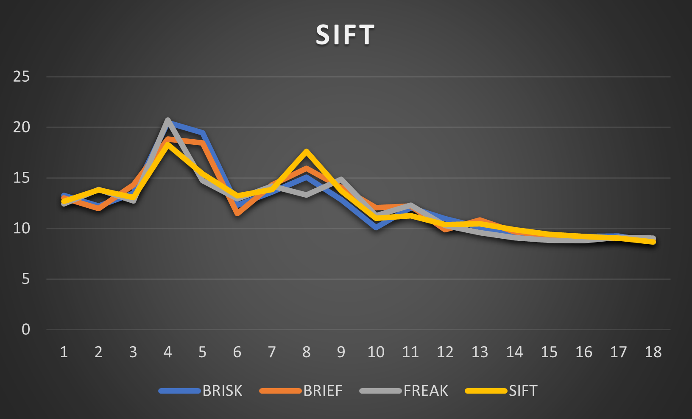

# Camera Project

## FP.1 : Match 3D Objects
In this task, I have implemented the algorithms that match the previous frame bounding boxes with the best bounding box in the current frame. 
this code as shown inserted in the "camFusion_Student.cpp".

The algorithms steps are:
- loop over matches to take the key points in the previous frame of this match
- select the bounding box that the key points exist in its ROI and store its index;
- same in the current frame.
- use the indices to increase the match counts to select the max count
to be inserted into the map (bbBestMatches).

```cpp
void matchBoundingBoxes(std::vector<cv::DMatch> &matches, std::map<int, int> &bbBestMatches, DataFrame &prevFrame, DataFrame &currFrame)
{
	int prev_size = prevFrame.boundingBoxes.size();
  	int curr_size = currFrame.boundingBoxes.size();
    int match_counts[prev_size][curr_size] = {0};

    for (int i = 0; i < matches.size(); ++i)
    {
      	std::vector<int> prev_bounding_index, curr_bounding_index;
        cv::KeyPoint prev_keypoint = prevFrame.keypoints[matches[i].queryIdx];
        for (int j = 0; j < prevFrame.boundingBoxes.size(); ++j)
        {
            if (prevFrame.boundingBoxes[j].roi.contains(prev_keypoint.pt))
            {
                prev_bounding_index.push_back(prevFrame.boundingBoxes[j].boxID);
            }
        }
		
      	cv::KeyPoint curr_keypoint = currFrame.keypoints[matches[i].trainIdx];
        for (int j = 0; j < currFrame.boundingBoxes.size(); ++j)
        {
            if (currFrame.boundingBoxes[j].roi.contains(curr_keypoint.pt))
            {
                curr_bounding_index.push_back(currFrame.boundingBoxes[j].boxID);
            }
        }

        for (int j = 0; j < prev_bounding_index.size(); ++j)
        {
            for (int k = 0; k < curr_bounding_index.size(); ++k)
            {
                match_counts[prev_bounding_index[j]][curr_bounding_index[k]]++;
            }
        }
    }

    for (int j = 0; j < prevFrame.boundingBoxes.size(); ++j)
    {
        int max_match_counts = 0;
        int max_index = 0;
        for (int k = 0; k < currFrame.boundingBoxes.size(); ++k)
        {
            if (match_counts[j][k] > max_match_counts)
            {
                max_match_counts = match_counts[j][k];
                max_index = k;
            }
        }
        bbBestMatches.insert({j, max_index});
    }
}
```
## FP.2 : Compute Lidar-based TTC
In this task, I have implemented the algorithms that compute the lidar TTC based-on the lidar points in consequent frame. 
this code as shown inserted in the "camFusion_Student.cpp".

The algorithms steps are:
- compute the median distance of the lidar points in the previous frame and current frame;
- compute the TTC using the equation "median_dist_curr * dT / (median_dist_prev - median_dist_curr)" where dT is the difference between the frames;
- median used to be more robust against lidar outliers.

```cpp
double calc_median(std::vector<LidarPoint> input_vec){
	double median_result = 0;

  	vector<double> x_vec;
  	for (int i =0;i<input_vec.size();++i)
    {
        x_vec.push_back(input_vec[i].x);
    }
	sort(x_vec.begin(), x_vec.end());
  	
    double median_idx = floor(x_vec.size() / 2.0);
    if (x_vec.size() % 2 == 0) 
        median_result = (x_vec[median_idx - 1] + x_vec[median_idx]) / 2.0;
    else
        median_result = x_vec[median_idx];
	return median_result;
}

void computeTTCLidar(std::vector<LidarPoint> &lidarPointsPrev,
                     std::vector<LidarPoint> &lidarPointsCurr, double frameRate, double &TTC)
{
    double dT = 1 / frameRate;
  	double median_dist_prev = calc_median(lidarPointsPrev);
	double median_dist_curr = calc_median(lidarPointsCurr);
    TTC = median_dist_curr * dT / (median_dist_prev - median_dist_curr);
}
```

## FP.3 : Associate Keypoint Correspondences with Bounding Boxes
The algorithm steps are:
- Create two empty vectors: matches_selected and matches_distance. 
- These vectors will hold the selected matches and their corresponding distances.
- Iterate through each match in the kptMatches vector. 
- For each match, get the corresponding keypoints in the previous and current frames, and check if the current keypoint is within the bounding box. 
- If the current keypoint is within the bounding box, add the match to the matches_selected vector and calculate the distance between the keypoints. 
- Add the distance to the matches_distance vector.
- Calculate the mean distance of the selected matches.
- Iterate through the selected matches again. For each match, check if the distance between the keypoints is less than the mean distance. If it is, add the match and its corresponding keypoint to the BoundingBox object.

```cpp
// associate a given bounding box with the keypoints it contains
void clusterKptMatchesWithROI(BoundingBox &boundingBox, std::vector<cv::KeyPoint> &kptsPrev, std::vector<cv::KeyPoint> &kptsCurr, std::vector<cv::DMatch> &kptMatches)
{ 
  	
    std::vector<cv::DMatch> matches_selected;
    std::vector<double> matches_distance;

  	// check the keypoints are within the bounding boxes
    for (int i = 0; i < kptMatches.size(); ++i)
    {
      	auto distance=cv::norm(kptsCurr[kptMatches[i].trainIdx].pt - kptsPrev[kptMatches[i].queryIdx].pt);
        if (boundingBox.roi.contains(kptsCurr[kptMatches[i].trainIdx].pt))
        {	
            matches_selected.push_back(kptMatches[i]);
            matches_distance.push_back(distance);
        }
      	else{
        	continue;
        }
    }
  	
	// calculate the mean of the match distances to fileter the points
  	// https://stackoverflow.com/questions/28574346/find-average-of-input-to-vector-c
    double meanDistance = std::accumulate(matches_distance.begin(), matches_distance.end(), 0.0) / matches_distance.size();
  	
    for (int i = 0; i < matches_distance.size(); ++i)
    {
        if (matches_distance[i] < meanDistance) // if near to the mean it's okey else continue;
        {
            boundingBox.kptMatches.push_back(matches_selected[i]);
          	boundingBox.keypoints.push_back(kptsCurr[matches_selected[i].trainIdx]);
        }
      	else{
        	continue;
        }
    } 
}
```
## FP.4 : Compute Camera-based TTC
The computeTTCCamera function computes the time-to-collision (TTC) between the camera and an object in front of it based on keypoint correspondences in successive images.
The algorithm steps are:
- It takes as input the keypoints detected in the previous and current frames, the keypoint matches between those frames, the frame rate, and pointers to the current and previous frames.
- The function first computes distance ratios between all matched keypoints, which are used to estimate the TTC.
- It does this by looping over all pairs of matched keypoints, computing the distance between them in the current and previous frames, and storing the distance ratio.
- The function then calculates the median distance ratio as a more robust estimate of the TTC than the mean distance ratio.
- Finally, the function computes the TTC using the formula TTC = -dT / (1 - medianDistRatio), where dT is the time between frames and medianDistRatio is the median distance ratio.

```cpp
// Compute time-to-collision (TTC) based on keypoint correspondences in successive images
void computeTTCCamera(std::vector<cv::KeyPoint> &kptsPrev, std::vector<cv::KeyPoint> &kptsCurr,
                      std::vector<cv::DMatch> kptMatches, double frameRate, double &TTC, cv::Mat *visImg)
{
    // compute distance ratios between all matched keypoints
    vector<double> distRatios; // stores the distance ratios for all keypoints between curr. and prev. frame
    for (auto it1 = kptMatches.begin(); it1 != kptMatches.end() - 1; ++it1)
    { // outer keypoint loop

        // get current keypoint and its matched partner in the prev. frame
        cv::KeyPoint kpOuterCurr = kptsCurr.at(it1->trainIdx);
        cv::KeyPoint kpOuterPrev = kptsPrev.at(it1->queryIdx);

        for (auto it2 = kptMatches.begin() + 1; it2 != kptMatches.end(); ++it2)
        { // inner keypoint loop

            double minDist = 100.0; // min. required distance

            // get next keypoint and its matched partner in the prev. frame
            cv::KeyPoint kpInnerCurr = kptsCurr.at(it2->trainIdx);
            cv::KeyPoint kpInnerPrev = kptsPrev.at(it2->queryIdx);

            // compute distances and distance ratios
            double distCurr = cv::norm(kpOuterCurr.pt - kpInnerCurr.pt);
            double distPrev = cv::norm(kpOuterPrev.pt - kpInnerPrev.pt);

            if (distPrev > std::numeric_limits<double>::epsilon() && distCurr >= minDist)
            { // avoid division by zero

                double distRatio = distCurr / distPrev;
                distRatios.push_back(distRatio);
            }
        } // eof inner loop over all matched kpts
    } // eof outer loop over all matched kpts

    // only continue if list of distance ratios is not empty
    if (distRatios.size() == 0)
    {
        TTC = NAN;
        return;
    }

    // use medianDistRatio is more robust than meanDistRatio
    std::sort(distRatios.begin(), distRatios.end());
    long medianIndex = floor(distRatios.size() / 2.0);
    double medianDistRatio = (distRatios.size() % 2 == 0) ? (distRatios[medianIndex-1] + distRatios[medianIndex]) / 2.0 : distRatios[medianIndex];

    double dT = 1 / frameRate;
    TTC = -dT / (1 - medianDistRatio);
}
```

## FP.5 : Performance Evaluation 1
### LIDAR CAMERA Comparison


from the above graph we noticed that the Lidar estimation deviated from the Camera at 3rd, 4th, and 5th images.

| Image 3                                     | Image 4                                     | Image 5                                     |
|---------------------------------------------|---------------------------------------------|---------------------------------------------|
|  |  |  |
The following examples show the difference between the camera and lidar readings, which shows a failure in the lidar estimation, which maybe due to the b


## FP.6 : Performance Evaluation 2
### Camera
In order to make the performance evaluation I have changed the "FinalProject_Camera.cpp" file to generate 2 text files, the first one TTC_Lidar to sort the TTC generated by lidar and the second one for the combination between detector/descriptors for each frame and finally store them in the excel file as provided.

I conducted tests using different combinations of detectors and descriptors with the same framework, and calculated camera-based time-to-collision (TTC) estimates. The results were presented in a table that showed some unstable and faulty estimates. The unstable estimates appeared frequently for certain detector types, such as FAST, BRISK, and ORB, while the faulty estimates were most common for HARRIS and ORB. The errors could be caused by issues with the keypoint detection and matching process.

As an example, the TTC estimate for image 14 was compared for two detector/descriptor combinations - SHITOMASI/SIFT and ORB/SIFT. The ORB/SIFT combination produced a clearly wrong estimate (623.139s), possibly due to the limited number of keypoints and matches detected. In contrast, the SHITOMASI/SIFT combination produced a reasonable estimate (12.190s), detecting 30% more keypoints and matches.



From the above table we can conclude that:
- Harris suffer from "nans" and "-inf" values
- ORB suffer from "-inf" and unreasonable values
- FAST has unreasonable values at image 5 and unstable values compare to the other algorithms
- SHITOMASI, AKAZE, and SIFT are more stable and reasonable, so I compared them together through the following graphs.

| SHITOMASI                    | AKAZE                        | SIFT                         |
|------------------------------|------------------------------|------------------------------|
|  |  |  |

from the above table we found the SHITOMASI are the most stable detector in comparison with AKAZE and SIFT. 
Also, by comparing the SHITOMASI with different descriptors, I found the FREAK is the most stable one.

